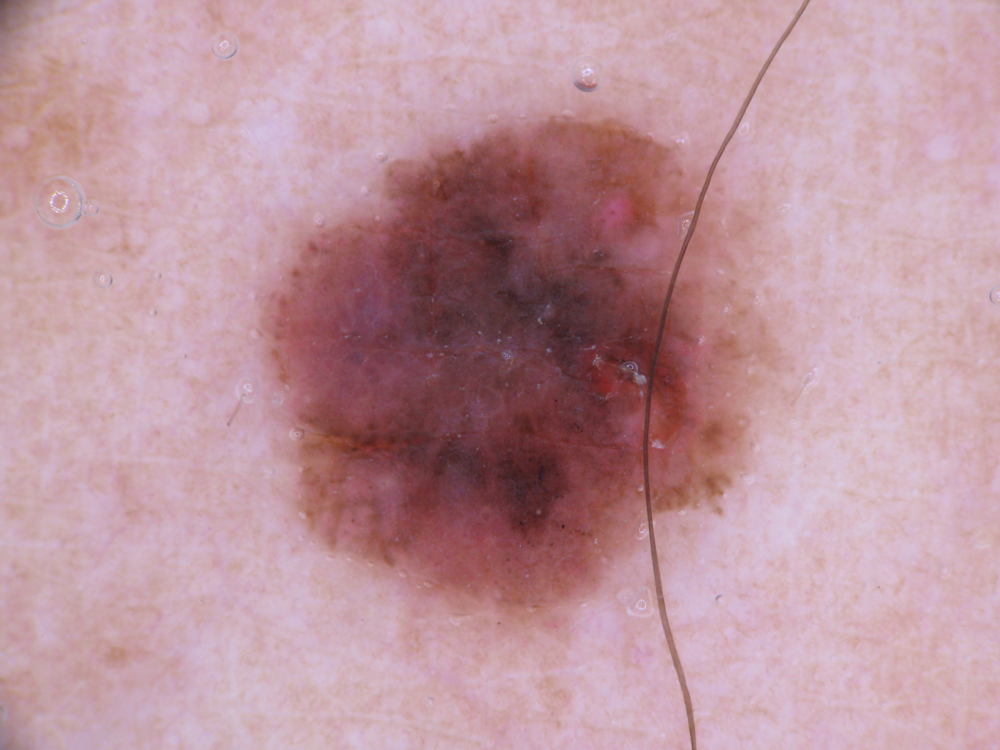

# Melanoma Cancer Detection

This GitHub repository contains code and resources to build a Convolutional Neural Network (CNN) based model for accurately detecting melanoma, a deadly type of skin cancer that accounts for 75% of skin cancer deaths. The goal of this project is to develop a solution that can evaluate skin images and alert dermatologists to the presence of melanoma, potentially reducing the manual effort required for diagnosis.

## Dataset

The dataset used for training and testing this model consists of 2239 images for training and 118 images for testing. The dataset includes various types of skin conditions, with varying numbers of samples for each class. Notably, the class `seborrheic keratosis` has the least number of samples, while the class `pigmented benign keratosis` has the highest number of samples.

The dataset used in this project is taken from  **International Skin Imaging Collaboration (ISIC)**.

## Data Augmentation

To address class imbalance and improve the robustness of the model, this project employs the Augmentor library. Augmentor is used to augment the dataset by creating additional samples for classes with fewer images. This helps to ensure that the model is trained effectively and can handle various cases.

## Model Accuracy

The CNN-based model developed in this project achieves an accuracy of 80-85% on the validation dataset. This level of accuracy is promising and indicates the potential of the model to assist dermatologists in the early detection of melanoma.

## Libraries Used

- TensorFlow
- Matplotlib
- NumPy
- Pandas
- Keras
- Augmentor

## Repository Contents

- `melanoma_cancer_detection.ipynb`: This Jupyter Notebook contains the code for building and training the melanoma detection model. You can run this notebook to train the model and evaluate its performance.

## Getting Started

To get started with the melanoma detection project, follow these steps:

1. Clone this repository to your local machine:

    `git clone https://github.com/yourusername/melanoma-cancer-detection.git`

2. Download the dataset from the provided dataset link and place it in the appropriate directory.

3. Open and run the `abrar_lohia_nn.ipynb` Jupyter Notebook to train and evaluate the model.

---

